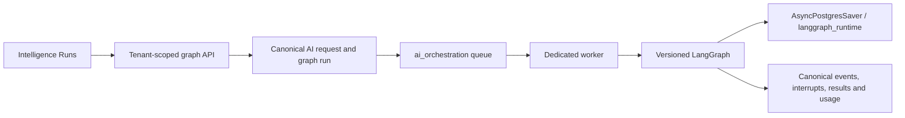
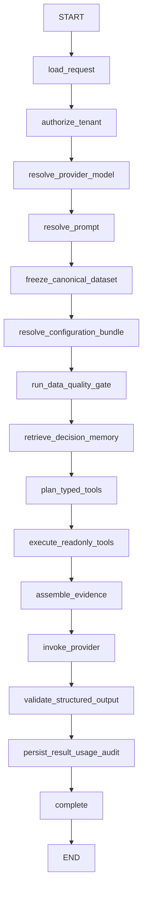
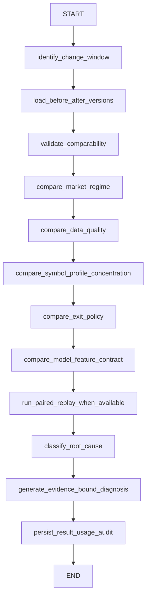
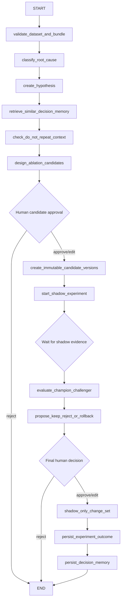

# Scalpyn LangGraph implementation report

Verdict before staging: `PARTIALLY_IMPLEMENTED_BLOCKED_BY_INFRA`.

## Outcome

LangGraph is installed above the existing systemic AI foundation without replacing canonical DB records, Celery or provider adapters. The implementation adds exact dependency pins plus a hash lock, a dedicated PostgreSQL checkpoint schema, immutable graph registry, four graphs, five canonical graph tables, five durable Celery tasks on an isolated queue, tenant-safe APIs, human interrupts, recovery/cancel paths, event reconciliation, telemetry, retention administration and the authenticated “Intelligence Runs” frontend.

Runtime defaults remain `native` with every LangGraph feature flag false. `LIVE_WRITE` is denied. No production configuration, model champion, Auto-Pilot flag, order or real position has been changed.

## Runtime architecture

## Systemic analysis graph

## Root-cause graph

## Regenerative shadow graph

## Verification state

- Mandatory LangGraph suite: `37 passed` `[test]`.
- Combined critical suite: `85 passed` `[test]`.
- Full backend collection: `1573 collected, 0 collection errors` `[test]`.
- Frontend tests: `23 passed` `[test]`.
- TypeScript: passed `[test]`.
- Production build: passed; `/intelligence-runs` present `[test]`.
- Scoped lint for changed frontend files: `0 errors` `[test]`.
- Global lint: `371 errors, 62 warnings` in legacy baseline `[test]`.
- Full backend execution stopped at `20 failures` after `278 passed`; failures are recorded verbatim in `LANGGRAPH_BACKEND_FULL_SUITE.txt` `[test]`.
- Hash-locked dependency resolution and `pip check`: passed `[test]`.

## Deployment status

Isolated staging resources are being prepared. Production is deliberately stopped at the explicit human checkpoint defined by the prompt. Paid provider canary is not authorized; it will not run on inferred consent.

## Rollback

Keep all flags false to make the new paths inert. If staging fails, stop the dedicated worker and restore the prior service deployment. Database rollback requires a backup because downgrade deletes checkpoint history. Application canonical records should be retained for audit even if checkpoint rows are removed under an approved retention policy.

## Ledger de evidências

| NÚMERO REPORTADO | ORIGEM | VALOR LITERAL DA FONTE |
|---|---|---|
| critical tests=`85` | `[test] pytest` | `85 passed` |
| mandatory tests=`37` | `[test] named suite` | `37 passed` |
| backend collected=`1573` | `[test] collect-only` | `1573 tests collected` |
| frontend tests=`23` | `[test] npm test` | `pass 23; fail 0` |
| frontend routes=`44` | `[test] next build` | `Generating static pages (44/44)` |
| graph definitions=`4` | `[test] registry/migration comparison` | `registry_migration_match=4` |
| production orders=`0` | `[config reconciliation]` | no production actions executed before checkpoint |
