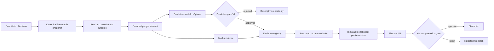

# ML / Profile Intelligence V2 — implementation and rollout

Status: **CONDITIONAL GO for migration + shadow collection; NO-GO for live automation**.

This changeset corrects the authority boundary that previously allowed replicated
indicator findings to be displayed as predictive approval. The historical model
artifact remains immutable.

## Architecture

## Producer / consumer matrix

| Component | Producer | Consumer | Contract | Identifier/version | Corrected risk |
|---|---|---|---|---|---|
| Shadow entry | `shadow_trade_service` | dataset builders/monitor | `shadow_trades` | `event_id`, `snapshot_id`, feature/barrier/label versions | aliases, missing hash and silent lineage |
| Shadow outcome | `shadow_trade_monitor` | datasets/evidence | `label_resolved_at` | barrier contract | unresolved label time |
| ML training | `MLChallengerService` | model registry/UI | `ml_models`, `ml_threshold_curve` | governance V2 + dataset hash | descriptive findings granting approval |
| Evidence | math/approved ML/Optuna | Profile Intelligence | `ml_evidence_registry` | cycle/source/target idempotency | rejected ML reaching calibration |
| Calibration | Profile Intelligence | challenger creator | Profile config + evidence refs | stable `condition_id` | array-index patches and incumbent mutation |
| Profile version | challenger creator | shadow/watchlist | `profile_versions` | hash, parent, cycle, state | champion mutation in-place |
| Score version | profile versioning | scoring lineage | `score_engine_versions` | config hash | unversioned scoring rules |
| Auto-Pilot | review cycle | authenticated operator | pending approval | per-user lock/cycle key | automatic approval/activation |
| ML UI | `/api/ml/models` | `/ml-models` | explicit statuses/authorities | model id/version | false green approval and hidden bucket |

## Contracts implemented

- Model governance: descriptive status, predictive status, and four independent authorities.
- v77 classification: descriptive validated; predictive rejected; every authority false.
- Entry feature schema `entry_features_v2`: canonical aliases, units, scales, ranges, freshness metadata, canonical hash.
- Snapshot lineage: new IDs, versions, timestamps, coverage, confidence/freshness slots, hashes and fail-closed eligibility.
- Economic targets: net return after costs, TP-before-SL, MFE, MAE and time-to-TP contracts.
- Dataset split: grouped temporal train/validation/test, purge at both boundaries and test embargo.
- Evidence registry: bucket/operator/range, CI, raw/effective N, windows, symbols, confidence and model authorization.
- Profile and score-engine versions: immutable config/hash records, idempotency and one shadow/champion partial constraints.

## v77 evidence and classification

The following values are inputs from the supplied independent audit, not recomputed in this changeset:

| Evidence | Value | Provenance |
|---|---:|---|
| Hold-out rows | 794 | `[input:audit]` |
| Weighted ROC AUC | 0.4797 | `[input:audit]` |
| FPR | 0.9485 | `[input:audit]` |
| F1 | 0.5900 | `[input:audit]` |
| Always-positive F1 | 0.6322 | `[input:audit]` |

The migration updates only governance columns and `metrics_json.governance_v2`
for the exact v77 model ID. It does not overwrite its blob, original metrics,
dataset hash, path, or training artifact.

## Feature flags

All new rollout flags are seeded `false` while preserving explicit existing values:

- `ml_predictive_gate_v2`
- `profile_versioning_v2`
- `calibration_evidence_registry_v1`
- `calibration_orchestrator_v1`
- `autopilot_calibration_v1`
- `counterfactual_outcomes_v1`
- `ev_score_v2`
- `ml_frontend_status_v2`

The safety corrections (false approval removal and no automatic live activation)
are not weakenable by a feature flag.

## Rollout

1. Apply migration 131 in a non-production PostgreSQL clone and run contract queries.
2. Deploy writers with all flags off; verify new shadows are written with canonical hashes.
3. Backfill only deterministic hashes/IDs; retain unresolved rows as `LEGACY_UNRESOLVED` and ineligible.
4. Enable evidence registry and versioning in shadow.
5. Collect a new untouched future hold-out; do not reuse the v77 test.
6. Enable predictive gate V2 for canary training. Optuna then searches on validation EV and freezes the threshold before test.
7. Enable calibration orchestrator only after evidence, replay and paired shadow A/B pass.
8. Keep `autopilot_calibration_v1` off until explicit operational approval.

Rollback: disable flags first, stop challenger creation, retain historical rows, then downgrade
131 only in a controlled non-production rollback rehearsal. Live candidates always remain
shadow-only until an authenticated human approval call.

## Verification performed

- Focused Python tests: pass.
- Existing intelligence gate tests: pass.
- Full backend suite: collection blocked by a pre-existing test that references
  `alembic/versions/023_taker_ratio_scale_v2.py`, currently stored outside the active migration directory.
- Python compilation: pass.
- TypeScript no-emit build check: pass.
- ESLint for ML models page: pass.
- Alembic graph: single head.
- Offline PostgreSQL SQL rendering: pass.
- Online migration: not executed because no development `DATABASE_URL` is configured.
- New training/E2E on a future hold-out: not executed because the new collection window does not yet exist.

## Remaining blockers

1. A PostgreSQL test database is required for online upgrade/downgrade rehearsal.
2. A future, untouched hold-out must be collected after the lineage writer is deployed.
3. Existing Profile Intelligence still has broad mathematical evidence producers; they must publish through the registry before `calibration_orchestrator_v1` is enabled.
4. The full requested candidate-to-champion E2E cannot legitimately pass until paired shadow outcomes exist.
5. Legacy tests reference migrations moved out of the active directory, and one Auto-Pilot test expects a win-rate default different from the service default; these are pre-existing suite inconsistencies.

## Production checkpoint — 2026-07-11

- Migration `131_ml_governance_v2` is active in production.
- The deterministic forward baseline created 33 current `CHAMPION` profile
  versions with zero seed errors; no historical shadow was assigned an
  invented version.
- New L3 writers were observed producing canonical IDs, hashes and exact
  profile/score version lineage with `eligible_for_training=true`.
- The future training policy is `ALL_CANDIDATES_CONTEXTUAL`, combining approved
  `L3` and counterfactual `L3_REJECTED` observations with source/profile and
  barrier context. It is represented by `L3_CONTEXTUAL_INTELLIGENCE` and has no
  execution authority.
- The predictive flag remains disabled. At the readiness query timestamp there
  were 93 canonical rows and zero resolved/trainable outcomes versus the
  configured minimum of 2800, so no legitimate retrain or promotion was run.
- Shadow outcome monitoring was isolated onto `structural_compute`, with a
  bounded fast-scan batch, so live execution and pipeline-scan backlogs cannot
  starve label resolution.
- The first isolated production tick was received immediately and completed in
  61.01 seconds: 50 processed, zero completed, zero errors. This confirms the
  scheduler/queue fix; the zero completed count means the new observations had
  not yet reached an outcome barrier.

## Evidence ledger

| Number reported | Origin | Literal source |
|---|---|---|
| hold-out rows = 794 | `[input:audit]` | supplied execution prompt |
| weighted AUC = 0.4797 | `[input:audit]` | supplied execution prompt |
| FPR = 0.9485 | `[input:audit]` | supplied execution prompt |
| F1 = 0.5900 | `[input:audit]` | supplied execution prompt |
| baseline F1 = 0.6322 | `[input:audit]` | supplied execution prompt |

## Calibration Evolution v2 checkpoint — 2026-07-11

The additive revision `132_calibration_orchestration_v2` closes the remaining
governance gap between analytical findings and a safe challenger:

- canonical `calibration_recommendations`, `calibration_proposals`,
  `calibration_state_events` and `calibration_results` records;
- Profile EV by immutable Profile Version and contextual Crypto EV by
  Profile Version + symbol + timeframe + explicit window;
- MATH + ML/OPTUNA consensus, evidence ownership/scope and stable-path checks;
- bounded ADD/UPDATE/REMOVE patches with stable rule IDs and no array-index mutation;
- an immutable Auto-Pilot clone, exclusive L3 Shadow watchlist and human-only
  live gate; the incumbent Profile config is not changed;
- the legacy `calibration/versions/{id}/apply` mutation is blocked fail-closed
  and the UI no longer presents an Apply-to-champion action;
- all write/compute endpoints are gated by the existing rollout flags. Read-only
  overview, proposal, timeline and EV history remain observable.

Production was migrated before the API/UI rollout. The verification query found
all six v2 tables and revision 132. No recommendation, proposal, state-event or
EV materialization was fabricated to demonstrate the workflow. All four rollout
flags remained disabled, so automatic calibration and live promotion stayed off.

### Calibration v2 evidence ledger

| Number reported | Origin | Literal source |
|---|---|---|
| migration tables = 6 | `[query: information_schema.tables]` | `"tables": 6` |
| recommendations = 0 | `[query: calibration_recommendations]` | `"recommendations": 0` |
| proposals = 0 | `[query: calibration_proposals]` | `"proposals": 0` |
| state events = 0 | `[query: calibration_state_events]` | `"events": 0` |
| profile EV rows = 0 | `[query: profile_version_ev_scores]` | `"profile_ev": 0` |
| contextual Crypto EV rows = 0 | `[query: crypto_profile_ev_scores]` | `"crypto_ev": 0` |
| enabled evidence flags = 0 | `[config: ml]` | `"evidence": 0` |
| enabled orchestrator flags = 0 | `[config: ml]` | `"orchestrator": 0` |
| enabled Auto-Pilot flags = 0 | `[config: ml]` | `"autopilot": 0` |
| enabled EV v2 flags = 0 | `[config: ml]` | `"ev_score": 0` |
| focused tests = 18 passed | `[command: pytest]` | `18 passed in 2.72s` |
