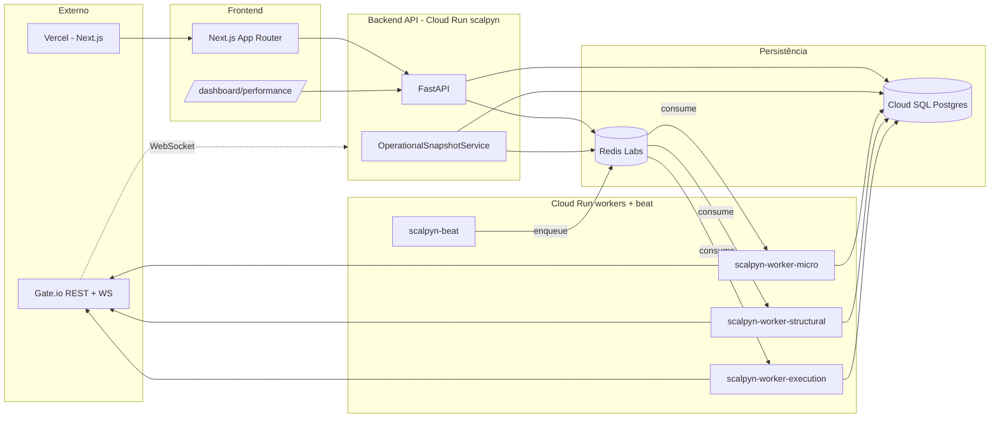

# 00 — Mapa do Sistema Scalpyn

> Map of Content (MOC) raiz do vault. Abra esta nota no Obsidian e use o
> **Graph view** (atalho `Ctrl/Cmd+G`) para visualizar a teia de
> relacionamentos entre todas as áreas.

Scalpyn é uma plataforma de trading institucional de criptoativos.
Este vault descreve, em **alto nível**, todas as áreas do sistema —
backend FastAPI, frontend Next.js, workers Celery, engines de trading,
infra Cloud Run e fluxos cross-área.

Profundidade: **1 arquivo por área** (~12 notas), não 1 por componente.
Para detalhes de implementação, siga os links de código apontados em
cada nota até o repositório (`backend/app/...`, `frontend/app/...`).

## Áreas

### Aplicação (Backend)
- [[10-backend-api]] — FastAPI, rotas, autenticação JWT, middlewares
- [[11-services]] — Camada de services (scoring, indicators, snapshot, persistence)
- [[12-engines]] — Engines de trading Spot e Futures, gates `is_active`/`is_tradable`
- [[13-scoring-ml]] — Scoring engine determinístico, pipeline ML, dataset
- [[14-models-database]] — SQLAlchemy, Alembic, schema bootstrap, `_critical_schema`
- [[15-exchange-integration]] — Gate.io REST + WebSocket, leader election

### Workers e Tarefas Assíncronas
- [[20-celery-topology]] — Filas, beat schedule, `acks_late`, hostname Cloud Run
- [[21-tasks-catalog]] — Catálogo de tasks por fila

### Frontend
- [[30-frontend]] — Next.js App Router, dashboards, proxy reverso

### Infra, Deploy, Observabilidade
- [[40-infra-cloudrun]] — Topologia 5 serviços, `start.sh`, `ASYNC_MIGRATIONS`
- [[41-deploy-cloudbuild]] — `cloudbuild.yaml`, trigger, `topology-check`
- [[42-observability]] — `OperationalSnapshotService`, alertas, Grafana

### Fluxos Cross-Área
- [[50-data-flow]] — Diagramas sequenciais dos 3 fluxos críticos

## Visão Geral (Mermaid)

## Convenções deste vault

- **Frontmatter** (`tags:`) descreve a categoria da nota: `#area`, `#worker`,
  `#service`, `#engine`, `#infra`, `#flow`.
- **Wiki-links** sempre apontam para outra nota deste vault, no formato
  `[[10-backend-api]]` (sem extensão `.md`).
- **Caminhos de código** aparecem em `monoespaçado` e referenciam o repo
  no estado atual de `main` (não há link clicável — copie e abra no editor).
- **Diagramas Mermaid** seguem a sintaxe nativa do Obsidian (live preview).
- Idioma: **PT-BR** (preferência do usuário, ver `replit.md`).
