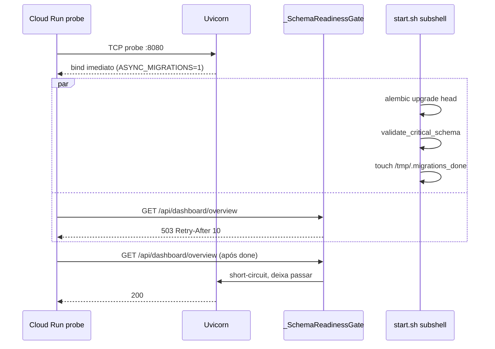

# 10 — Backend API (FastAPI)

App FastAPI servida pelo Cloud Run service `scalpyn` na porta `8080`.
Em dev, roda em `8000` via `uvicorn app.main:app --reload`. O frontend
Next.js sempre conversa com a API por meio do **proxy reverso**
`frontend/app/api/[...path]/route.ts` — nunca direto do browser.

Voltar ao [[00-INDEX]].

## Componentes principais

- `backend/app/main.py` — entrypoint FastAPI, lifespan, montagem de routers,
  middleware `_SchemaReadinessGate`, endpoints `/api/health` e
  `/api/health/schema`.
- `backend/app/config.py` — `Settings` (Pydantic), validador que converte
  `postgresql://` → `postgresql+asyncpg://`.
- `backend/app/database.py` — engines async (API + Celery + watchdog),
  `run_db_task`, `get_db`, pool stats logger.
- `backend/app/api/` — um módulo por domínio de rota:
  - Auth/Config: `auth.py`, `config.py`
  - Mercado: `market.py`, `pools.py`, `exchanges.py`, `asset_search.py`
  - Watchlists: `watchlist.py`, `watchlists.py`, `custom_watchlists.py`,
    `pipeline_watchlists.py`
  - Trading: `trades.py`, `orders.py`, `positions.py`, `spot_engine.py`,
    `futures_engine.py`
  - Decisões: `decisions.py`, `simulations.py`
  - ML: `ml.py`
  - Performance/dashboards: `dashboard.py`, `performance.py`, `analytics.py`,
    `reports.py`, `backoffice.py`
  - Sistema: `system.py`, `metrics.py`, `admin_diagnostics.py`,
    `debug_indicators.py`, `debug_collect.py`, `notifications.py`,
    `ai_keys.py`, `ai_skills.py`, `profiles.py`, `websocket.py`

## Lifespan (startup/shutdown)

`backend/app/main.py:42` — `lifespan()` arranca em ordem:
1. `init_db()` (apenas em dev, gated por `SKIP_LIFESPAN_INIT_DB`).
2. Warm-up do pool de DB (`SELECT 1`).
3. Pool stats logger.
4. Schedulers in-process (structural / microstructure / pipeline / combined-legacy).
5. Subscriber Redis→WebSocket de eventos de decisão (ver [[15-exchange-integration]]).
6. Gate.io WebSocket leader election.
7. Persistence queue + workers ([[11-services]] §Persistence).
8. `OperationalSnapshotService` ([[42-observability]]).

Cada um falha de forma não-fatal: erro vira WARNING, app continua de pé.

## Schema readiness gate

Detalhes em [[40-infra-cloudrun]] §ASYNC_MIGRATIONS.

## Endpoints sempre liberados pelo gate

- `/api/health` e `/api/health/schema` ([[14-models-database]] §`_critical_schema`)
- `/metrics` (Prometheus, bearer-token)
- `/api/system/persistence`

## CORS

Permite os domínios Vercel + qualquer subdomínio `*.replit.app`,
`*.replit.dev`, `*.repl.co`, `*.vercel.app`.

## Envs principais

| Env | Default | Uso |
|-----|---------|-----|
| `DATABASE_URL` | — | Postgres (asyncpg) |
| `JWT_SECRET` | `supersecret` (dev) | Assinatura de tokens |
| `ENCRYPTION_KEY` | placeholder | AES p/ creds de exchange |
| `REDIS_URL` | `redis://localhost:6379/0` | Broker Celery + cache + pub/sub |
| `BACKEND_URL` | `http://localhost:8000` | Lido pelo proxy do Next.js |
| `PROMETHEUS_BEARER_TOKEN` | — | Habilita `/metrics` |
| `ENABLE_GATE_WS` | `0` | Liga o WS de order flow |
| `ASYNC_MIGRATIONS` | `0` | Liga schema gate em background (apenas `scalpyn`) |
| `SKIP_LIFESPAN_INIT_DB` | unset | Pular `init_db()` no boot |
| `WEB_CONCURRENCY` | `1` | Workers uvicorn por container |

## Áreas relacionadas

[[11-services]] · [[14-models-database]] · [[20-celery-topology]] ·
[[30-frontend]] · [[40-infra-cloudrun]] · [[42-observability]]
