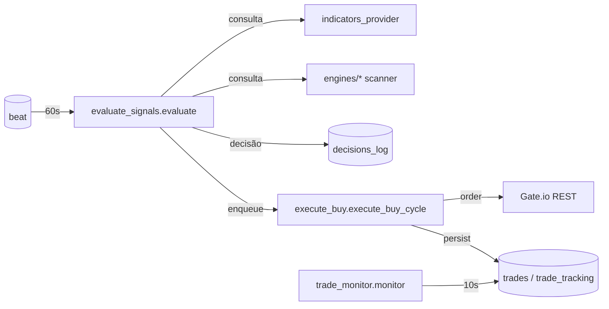

# 12 — Engines de Trading (Spot + Futures)

Engines são objetos in-process que mantêm o ciclo `evaluate → execute`
de cada usuário. Vivem em `backend/app/engines/` e expõem rotas de
controle via `app/api/spot_engine.py` e `app/api/futures_engine.py`.

Voltar ao [[00-INDEX]].

## Componentes principais

### Spot
- `spot_scanner.py` — `SpotScanner` por usuário, registry global
  (`get_engine` / `register_engine` / `unregister_engine`).
- `spot_position_manager.py` — abre/atualiza posições.
- `spot_capital_manager.py` — sizing, alocação por ativo.
- `spot_sell_manager.py` — saídas (TP/SL/manual).

### Futures
- `futures_scanner.py` — análogo ao SpotScanner para futures.
- `futures_position_manager.py` — exposições alavancadas.
- `futures_risk_engine.py` — limites de risco.
- `futures_anti_liq.py` — proteção anti-liquidação (task
  `anti_liq_monitor.monitor` na fila execution, ver [[20-celery-topology]]).
- `futures_emergency.py` — modo de emergência.
- `futures_macro_gate.py` — gate macro (BTC dominance, regime).

## Ciclo evaluate → execute

## Gates de pool: `is_active` vs `is_tradable`

Convenção crítica (Task #232, migração 043, citada em `replit.md`):

| Coluna `pool_coins.*` | Gate de... | Default | Lido por |
|---|---|---|---|
| `is_active` | **Ingestão** | `true` | collector, indicators, scoring, `pipeline_scan` funnel, WS resolver |
| `is_tradable` | **Execução** | `false` | apenas `evaluate_signals` e `execute_buy` |

Trigger BEFORE-UPDATE espelha `is_approved → is_tradable` para
compatibilidade com paths SQL legados. Lint test
`test_pool_queries_filter_*` (`backend/tests/test_celery_routing_invariants.py`)
garante que cada arquivo filtra na coluna correta. Runbook do operador:
`backend/docs/runbooks/pool-execution-gate.md`.

## Endpoints de controle

- `POST /api/spot-engine/start`, `/stop`, `/status`
- `POST /api/futures-engine/start`, `/stop`, `/status`

Estado por usuário fica no registry in-process — **não persistido**, então
um restart da API derruba todos os engines (esperado; usuário religa pela UI).

## Envs relevantes

| Env | Uso |
|-----|-----|
| `BACKGROUND_SCHEDULER_CONCURRENCY` | Default `3`. Teto = 4 (ver [[42-observability]] §gotchas) |
| `ENABLE_GATE_WS` | Necessário para `taker_ratio` real-time |

## Áreas relacionadas

[[11-services]] · [[13-scoring-ml]] · [[15-exchange-integration]] ·
[[20-celery-topology]] · [[21-tasks-catalog]] · [[50-data-flow]]
