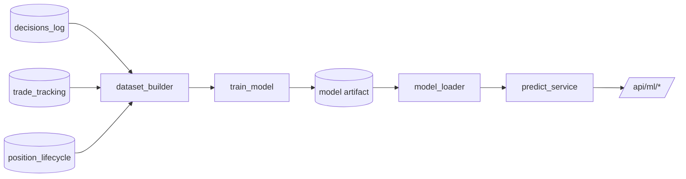

# 13 — Scoring Engine + ML

Voltar ao [[00-INDEX]].

## Scoring engine determinístico

Fórmula (citada em `replit.md` §Architecture decisions):

```
score = (sum_matched_points / total_possible_points) × 100
```

Confidence influencia o gate `can_trade` mas **não** entra como
multiplicador no numerador/denominador.

### Componentes

- `backend/app/services/score_engine.py` — orquestra a leitura via
  [[11-services]] §indicators_provider e a aplicação das regras.
- `backend/app/scoring/` — camadas por dimensão:
  - `layer_momentum.py`
  - `layer_volatility.py`
  - `layer_order_flow.py`
  - `layer_liquidity.py`
  - `layer_structure.py`
  - `futures_pipeline_scorer.py` — agregador específico para futures.
- `backend/app/services/robust_indicators/` — variante "robusta" usada por
  `compute_scores.score` (Task #234 fallback).

### Persistência de scores

- `alpha_scores` — uma linha por (símbolo, ts) com `confidence_score`,
  `scoring_version` (Task #234).
- `pipeline_watchlist_assets.score_long` / `score_short` /
  `confidence_score` — estado mais recente por watchlist.

### Versão de scoring

`alpha_scores.scoring_version` é exposta em `/api/health/schema` como
**advisory** até ser promovida a `CRITICAL_COLUMNS` (Task #235). Ver
[[14-models-database]].

## Pipeline ML

Pasta `backend/app/ml/`:

- `dataset_builder.py` — constrói features a partir de `decisions_log`,
  `trade_tracking` e `position_lifecycle`.
- `train_model.py` — treino offline.
- `model_loader.py` — carrega o modelo serializado.
- `predict_service.py` — inferência em runtime (consumida por
  `app/api/ml.py`).
- `evaluation_report.py` — métricas de avaliação.



### Endpoints ML

- `GET /api/dashboard/ml-dataset` — métricas do dataset.
- `GET /api/dashboard/ml-dataset/export` — export CSV.
- `app/api/ml.py` — predict + treino on-demand.

## Áreas relacionadas

[[11-services]] · [[14-models-database]] · [[20-celery-topology]] ·
[[21-tasks-catalog]] · [[30-frontend]] · [[42-observability]]
