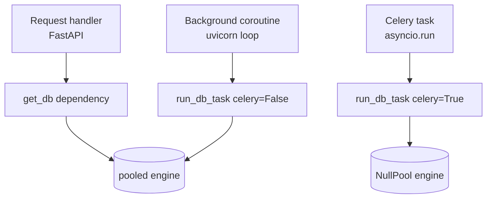

# 14 — Models + Database + Alembic

Postgres (Cloud SQL em prod, Replit-managed em dev), acessado via
SQLAlchemy 2.0 async (asyncpg). TimescaleDB tratado como ausente
graciosamente (ver `replit.md` §Gotchas).

Voltar ao [[00-INDEX]].

## Componentes principais

### Models (ORM)
`backend/app/models/`:

| Arquivo | Tabela(s) principais |
|---------|----------------------|
| `user.py` | `users` |
| `pool.py` | `pools`, `pool_coins`, `market_metadata` |
| `pipeline_watchlist.py` | `pipeline_watchlists`, `pipeline_watchlist_assets`, `pipeline_watchlist_rejections` |
| `custom_watchlist.py` | `custom_watchlists` |
| `profile.py`, `config_profile.py` | `watchlist_profiles`, perfis de config |
| `trade.py` | `trades` |
| `trade_tracking.py` | `trade_tracking` |
| `trade_simulation.py` | `trade_simulations` |
| `position_lifecycle.py` | `position_lifecycle` (consumido por `/api/performance/*`) |
| `order.py` | `orders` |
| `exchange_connection.py`, `exchange_execution.py` | conexões e execuções |
| `indicator_snapshot.py` | `indicators` (partição por `scheduler_group`) |
| `notification.py`, `backoffice.py` | notificações, ops |
| `ai_provider_key.py`, `ai_skill.py` | vault IA |

Não documentamos `decisions_log`, `alpha_scores` e `ohlcv` em arquivo
próprio — elas são geridas por Alembic (sem ORM dedicado completo) e
descritas em [[13-scoring-ml]] e [[50-data-flow]].

### Engines async (`backend/app/database.py`)

Três engines distintos:

- `engine` (pooled, default) — usado por handlers FastAPI via `get_db`.
  `command_timeout=60s`, `application_name="scalpyn-{K_SERVICE}-api"`.
- `_celery_engine` (NullPool) — usado por tasks Celery via
  `run_db_task(fn, celery=True)`. `command_timeout=180s` +
  `idle_in_transaction_session_timeout=300000ms`.
- `_orphan_watchdog_engine` (NullPool) — admin connection do
  `app/tasks/orphan_tx_watchdog.py`. `application_name="scalpyn-orphan-watchdog"`.

### Sessions — 3 padrões válidos

(ver bloco de comentários em `database.py:320`+)

Regra de ouro: **nunca** chamar `await db.rollback()` dentro de
`async with db.begin_nested()` (ver `replit.md` §Gotchas — quebra a
outer tx do `run_db_task`).

## Alembic

`backend/alembic/versions/` — migrações numeradas (`001` → `044`).
Última versão (no momento desta doc): `044_executions_lifecycle.py`.

Convenção crítica (`replit.md` §Gotchas + skill
`alembic-migration-guardrails`):
- Para colunas em tabelas hot, pre-aplicar DDL em Cloud SQL antes do deploy.
- Adicionar coluna nova ao `_critical_schema.py` apenas em **deploy N+1**
  (após confirmar que ela existe em prod).

### Schema bootstrap (Cloud Run)

Detalhes em [[40-infra-cloudrun]] §start.sh. Resumo:
1. `start.sh` → `alembic upgrade head` (3 retries × 90s).
2. `validate_critical_schema` cruza `information_schema.columns` com a
   lista de `_critical_schema.CRITICAL_COLUMNS`.
3. Se faltar coluna crítica → exit 1 → Cloud Run rolla a revisão.

`/api/health/schema` faz a mesma checagem em runtime e retorna 503 se algo
sumir (silent drift detection).

## `_critical_schema.py`

`backend/app/_critical_schema.py` — lista única `(tabela, coluna)`
consumida por:
- `health_check_schema` em `app/main.py`
- `scripts/check_critical_schema.py` (boot gate)

Módulo zero-dependency (não importa SQLAlchemy nem `app.config`) para
poder rodar em contexto stripped-down.

## Tabelas hot — colunas mais sensíveis

- `pools.overrides`, `pools.autopilot_enabled`
- `pipeline_watchlist_assets.refreshed_at`, `analysis_snapshot`,
  `score_long`, `score_short`, `confidence_score`, `futures_direction`
- `decisions_log.direction`, `event_type`, `processed`, `outcome`
- `indicators.scheduler_group`, `market_type`
- `pool_coins.is_approved`, `is_active`, `is_tradable`
- `trade_tracking.status`, `exit_price`, `outcome`, `exit_price_source`

## Áreas relacionadas

[[10-backend-api]] · [[11-services]] · [[20-celery-topology]] ·
[[40-infra-cloudrun]] · [[41-deploy-cloudbuild]] · [[42-observability]]
