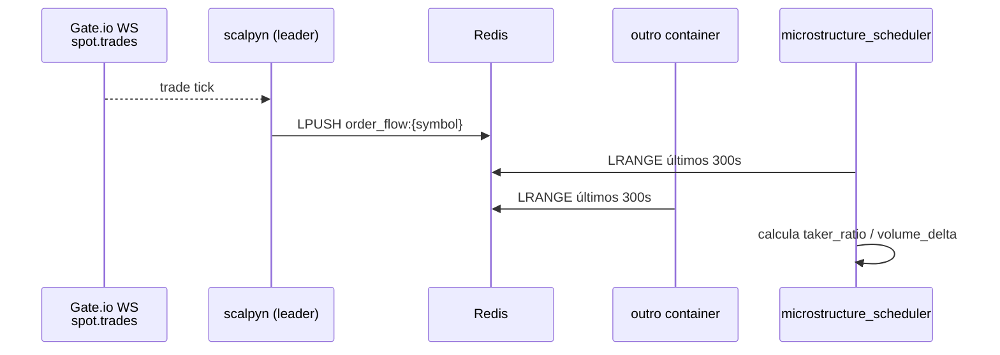

# 15 — Integração com Exchanges (Gate.io)

Único exchange em produção é **Gate.io** (Spot + Futures). O adapter
para Binance existe como esqueleto mas não está em uso ativo.

Voltar ao [[00-INDEX]].

## Componentes principais

### Adapters REST
`backend/app/exchange_adapters/`:
- `base_adapter.py` — interface comum.
- `gate_adapter.py` — chamadas Gate.io API v4 (orders, fills, OHLCV,
  saldos).
- `binance_adapter.py` — esqueleto, não está rotado.

### WebSocket (real-time order flow, Task #171)
`backend/app/websocket/`:
- `gate_ws_client.py` — cliente WS Gate.io Spot. Subscreve
  `spot.trades` por símbolo, alimenta buffer Redis com taker trades.
- `event_handlers.py` — dispatch de eventos.
- `scalpyn_ws_server.py` — WS server interno usado pelo browser
  (Connection Manager via `app/api/websocket.py`).

### Leader election
`backend/app/services/gate_ws_leader.py` —
`start_gate_ws_with_leader_election`. Em deploys multi-instância apenas
o container que ganha o lock Redis `gate_ws:leader` abre o WS; demais
ficam só como leitores do buffer. Sem Redis acessível e
`ENABLE_GATE_WS=1`, fica em retry infinito (gotcha citada em `replit.md`).

### Bridge real-time → browser
`backend/app/services/realtime_bridge.py` —
`start_decision_event_subscriber`. Workers Celery publicam eventos de
decisão em pub/sub; este task assinante encaminha para o
`ConnectionManager` que faz `broadcast()` ao browser. Sem este bridge a
página `/decisions` cai pra polling REST (não quebra).

## Fluxo de order flow (taker_ratio / volume_delta)

REST polling em `order_flow_service.py` segue como **fallback** quando
o WS está fora.

## Persistência das credenciais

- Tabela `exchange_connection` — chaves de API criptografadas com
  `ENCRYPTION_KEY` (AES-128).
- `app/api/exchanges.py` + `ai_keys.py` — endpoints CRUD.

## Envs

| Env | Default | Uso |
|-----|---------|-----|
| `ENABLE_GATE_WS` | `0` | Liga o WS leader election |
| `REDIS_URL` | `redis://localhost:6379/0` | Buffer + lock + pub/sub |
| `ENCRYPTION_KEY` | placeholder | AES p/ creds |

## Áreas relacionadas

[[11-services]] · [[12-engines]] · [[20-celery-topology]] ·
[[42-observability]] · [[50-data-flow]]
