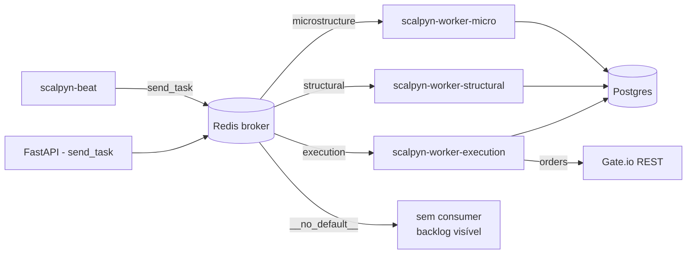

# 20 — Topologia Celery

Sistema de filas Celery 5.6+ sobre Redis (broker e backend). Definido
em `backend/app/tasks/celery_app.py`.

Voltar ao [[00-INDEX]].

## Filas

| Fila | Cadência | Workload | Service Cloud Run |
|------|----------|----------|-------------------|
| `microstructure` | 5 min | OHLCV 5m + indicadores rápidos (`collect_5m`, `compute_5m`) | `scalpyn-worker-micro` |
| `structural` | 15 min – 1 h | OHLCV 1h, TA pesado, scoring, `pipeline_scan` | `scalpyn-worker-structural` |
| `execution` | 60 s ou menos | Decisões e ordens (`evaluate`, `execute_buy_cycle`, `trade_monitor`, `anti_liq`) | `scalpyn-worker-execution` |
| `__no_default__` | n/a | Sentinela (sem consumer); pega tasks sem rota → backlog visível | — |

`ALL_QUEUES = (microstructure, structural, execution)` é o source of
truth importado por `OperationalSnapshotService` ([[42-observability]]).

### Sentinela `__no_default__`

Declarada em `task_queues` para satisfazer kombu (Celery ≥ 5.6 levanta
`KeyError` em todo `send_task` / beat tick se `task_default_queue` não
existir). **Não remover.** Ver `replit.md` §Gotchas.

## Fluxo broker → worker

## Cost guards

`celery_app.py:171+` define três bundles aplicados via `task_annotations`:

| Bundle | `time_limit` | `soft_time_limit` | `rate_limit` | `max_retries` |
|--------|-------------|-------------------|--------------|----------------|
| `_MICRO_GUARDS` | 480s | 420s | 12/m | 3 |
| `_STRUCTURAL_GUARDS` | 600s | 540s | 2/m | 3 |
| `_EXECUTION_GUARDS` | 120s | 100s | 4/m | 3 |

`_MICRO_GUARDS.time_limit` foi 180→480s em 2026-05-08 (ver runbook
`backend/docs/runbooks/2026-05-08-pipeline-recovery.md`).

## `acks_late`: política dual

`task_acks_late=True` global + `task_reject_on_worker_lost=True`. **Mas**
tasks idempotentes beat-driven recebem override `acks_late=False`
(`_NO_REQUEUE_ON_WORKER_LOSS`):
- `collect_5m`, `collect_all`
- `compute_5m`, `compute`
- `score`, `pipeline_scan.scan`
- `orphan_tx_watchdog.kill_orphans`

Tasks de execução financeira mantêm `acks_late=True`:
- `evaluate_signals.evaluate`
- `execute_buy_cycle`

Justificativa completa em `replit.md` §Gotchas (Task #245).

## `--hostname` no Cloud Run

`HOSTNAME=localhost` em todo container Cloud Run. Sem `--hostname` todos
os workers se anunciam como `celery@localhost` e
`celery_app.control.inspect()` deduplica → dashboard reporta `Workers: 0`
mesmo com pipeline drenando. `start.sh` gera
`CELERY_NODENAME="${K_SERVICE:-celery}-<uuid8>"` e passa
`--hostname="celery@${CELERY_NODENAME}"`. **Não remover.**

## Beat schedule (estado atual de `main`)

`celery_app.conf.beat_schedule` em `backend/app/tasks/celery_app.py`:

| Task | Schedule |
|------|----------|
| `collect_market_data.collect_all` | 60s |
| `collect_market_data.collect_5m` | 300s |
| `pipeline_scan.scan` | 300s |
| `execute_buy.execute_buy_cycle` | 60s |
| `anti_liq_monitor.monitor` | 120s |
| `macro_regime_update.update` | 1800s |
| `fetch_market_caps.fetch_market_caps` | 1800s |
| `auto_discover_assets.discover` | 3600s |
| `simulation.run_simulation_batch` | crontab `*/10 min` |
| `robust_alerts.evaluate` | 90s |
| `symbol_health_audit.monitor_only` | 300s |
| `decision_log_enricher.enrich` | 300s |
| `trade_reconciliation.reconcile` | 60s |
| `trade_monitor.monitor` | 10s |
| `orphan_tx_watchdog.kill_orphans` | 300s |
| `daily_summary.send` | crontab `20:00 UTC` |

**Não estão no beat** (rodam encadeadas em chain a partir de outras
tasks ou são disparadas manualmente / por API):
`compute_indicators.compute`, `compute_indicators.compute_5m`,
`compute_scores.score`, `evaluate_signals.evaluate`,
`ohlcv_backfill.backfill`, `simulation.run_trade_simulation`,
`simulation.get_simulation_stats`, `symbol_health_audit.run_repair`.

Catálogo de assinaturas e responsabilidades em [[21-tasks-catalog]].

## Envs

| Env | Default | Uso |
|-----|---------|-----|
| `WORKER_QUEUES` | (depende de `K_SERVICE`) | Filas que o container consome |
| `CELERY_CONCURRENCY` | `1` (workers), `0` (beat) | Slots paralelos |
| `CELERY_INSPECT_TIMEOUT_S` | `2.0` | Cada `inspect()` |
| `CELERY_INSPECT_BUDGET_S` | `8.0` | Probe agregado |
| `CELERY_DB_COMMAND_TIMEOUT` | `180` | asyncpg p/ Celery sessions |
| `BACKGROUND_SCHEDULER_CONCURRENCY` | `3` | Schedulers in-process |

## Áreas relacionadas

[[10-backend-api]] · [[11-services]] · [[14-models-database]] ·
[[21-tasks-catalog]] · [[40-infra-cloudrun]] · [[42-observability]]
