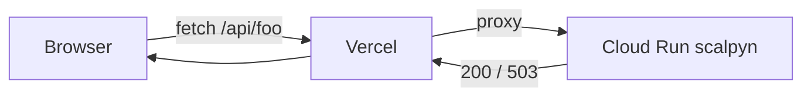

# 30 — Frontend (Next.js 16)

App Router, TypeScript, TailwindCSS, shadcn/ui. Hospedado na Vercel
(`scalpyn.vercel.app`). Em dev roda na porta `5000`.

Voltar ao [[00-INDEX]].

## Estrutura

```
frontend/
├── app/                      App Router (server + client components)
│   ├── api/[...path]/        Catch-all proxy reverso → BACKEND_URL
│   ├── dashboard/
│   │   ├── operations/       (in-progress)
│   │   ├── performance/      Centro Operacional (Task #225)
│   │   ├── MonitoringTab.tsx Aba legacy (mantida p/ retrocompat)
│   │   └── page.tsx
│   ├── trading-desk/         spot, futures, history, positions
│   ├── watchlist/            Funnel L1→L2→L3 ([[12-engines]])
│   ├── decisions/            Decision Log
│   ├── pools/, profiles/, trades/, replay/
│   ├── analytics/, reports/, alerts/
│   ├── admin/, backoffice/, settings/
│   ├── login/, register/
│   └── layout.tsx, page.tsx
├── components/
│   ├── auth/, layout/, settings/
│   ├── trading-desk/shared/
│   ├── pools/, profiles/, watchlist/
│   ├── shared/PoolSelector.tsx
│   └── ServiceWorkerRegistrar.tsx
├── hooks/                    useEngineStatus, usePerformance,
│                             useTradingConfig, useWebSocket, ...
├── lib/                      api, auth, scoreBand, scoreRulesSummary
├── stores/                   useAppStore, useAuthStore (Zustand)
└── proxy.ts                  middleware Next (matcher)
```

## Proxy reverso

`frontend/app/api/[...path]/route.ts` — todas as chamadas
`fetch('/api/...')` no browser caem nesta route handler do Next, que
encaminha para `BACKEND_URL` (Cloud Run service `scalpyn`). Trailing
slash é adicionado para `COLLECTION_ROUTES`.



Token JWT vive em `localStorage` (client-only). `proxy.ts` (middleware
Next) hoje só passa requests adiante.

## Dashboards principais

### `/dashboard/performance` — Centro Operacional (Task #225)

Página rewrite consumindo `GET /api/dashboard/overview` (ver
[[42-observability]]). Painéis:
- Health agregado
- System status (Celery + Redis + DB + score + ingestion)
- Latências (ingestion, decision, processing)
- Alerts (`pool_starved`, `ingestion_stale`, `worker_offline_60s`, etc.)
- Eventos (worker on/off, redis up/down)

Endpoints per-família (debug):
`/api/dashboard/celery`, `/redis`, `/db-health`, `/score-engine`,
`/pipeline-latency`, `/ingestion`, `/alerts`, `/events`.

### `/dashboard/performance` — Painéis Task #224 (sete cards)

`MonitoringTab.tsx` legacy + cards: health, system status, ingest rate,
decisions, trades, sim-vs-real, ML dataset.

### `/trading-desk/spot|futures|positions|history`

UI para começar/parar engines ([[12-engines]]) e acompanhar posições
abertas. Hooks: `useEngineStatus`, `usePositions`.

### `/watchlist`

Tabela do funnel de pipeline com `EvaluationTraceBreakdown`,
`RejectedAssetTable`, `PipelineAssetTable`, `AddCoinModal`.

### `/decisions`

Decision Log paginado com filtros por tipo de evento.

## Envs (frontend)

| Env (Vercel) | Uso |
|--------------|-----|
| `BACKEND_URL` | Backend para o proxy reverso (root, `/api` é stripado) |

## Pré-deploy obrigatório

`replit.md` §User preferences:

```bash
cd frontend && npx tsc --noEmit -p .
```

Vercel falha com qualquer type error. Rodar antes do `mark_task_complete`
evita ciclo de deploys vermelhos.

## Áreas relacionadas

[[10-backend-api]] · [[12-engines]] · [[13-scoring-ml]] ·
[[42-observability]]
