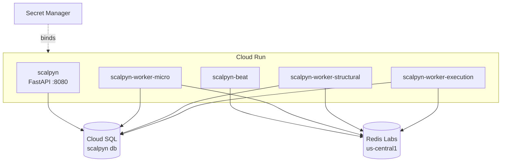

# 40 — Infra (Cloud Run, start.sh, Dockerfile)

Voltar ao [[00-INDEX]].

## Topologia: 5 serviços Cloud Run

| Serviço (`K_SERVICE`) | Papel | Filas consumidas | `min-instances` |
|-----------------------|-------|-------------------|-----------------|
| `scalpyn` | API FastAPI | — | 1 |
| `scalpyn-worker-micro` | Celery worker | `microstructure` | 1 |
| `scalpyn-worker-structural` | Celery worker | `structural` | 1 |
| `scalpyn-worker-execution` | Celery worker | `execution` | 1 |
| `scalpyn-beat` | Celery beat | (nenhuma — só schedules) | 1 |

**Faltar qualquer um deixa o pipeline silenciosamente parado.** Step
final `topology-check` em `cloudbuild.yaml` falha vermelho se algum
estiver ausente. Ver [[41-deploy-cloudbuild]] e runbook
`backend/docs/runbooks/cloud-run-celery-topology.md`.



## `start.sh`

Entrypoint único de todos os 5 serviços (`backend/start.sh`). Decide o
modo pelo `K_SERVICE`:

- `scalpyn-beat` → `celery beat` (sem worker).
- `scalpyn-worker-*` → `celery worker --queues=$WORKER_QUEUES --hostname=...`.
- Default (`scalpyn` / dev) → schema gate + `uvicorn`.

### Schema gate

```mermaid
flowchart TD
    A[start.sh entry] --> B{ASYNC_MIGRATIONS=1?}
    B -- não --> SYNC[alembic upgrade head<br/>3x retry x 90s]
    B -- sim --> BG[subshell em background]
    SYNC --> VAL[validate_critical_schema]
    VAL --> UVI[uvicorn :8080]
    BG --> BGSCHEMA[alembic + validate]
    BG --> BGUVI[uvicorn :8080]
    BGSCHEMA -- success --> DONE[/tmp/.migrations_done]
    BGSCHEMA -- fail --> FAILED[/tmp/.migrations_failed]
    DONE --> READY[middleware libera tráfego]
    FAILED --> KILL[watchdog SIGTERM<br/>Cloud Run rolla revisão]
```

Detalhes em [[10-backend-api]] §Schema readiness gate e em `replit.md`
§Gotchas (`ASYNC_MIGRATIONS=1`).

### Watchdog `procps`

`is_process_alive` em `start.sh:281` usa `ps -o stat= -p`. Sem o pacote
`procps` (não vem em `python:3.12-slim`) o watchdog **falha aberto** —
zumbis não são detectados. **Não remover** `procps` do
`backend/Dockerfile`.

## `Dockerfile`

Build multi-stage:
1. **builder** — `gcc`, `libpq-dev`, instala deps em `/install`.
2. **runtime** — `libpq-dev`, **`procps`**, copia `/install`.

Defaults importantes:
- `WEB_CONCURRENCY=1` — 1 worker uvicorn por container (era 2; reduzido
  para cortar consumo de memória durante boot, ver `replit.md`).
- `PORT=8080`
- `HEALTHCHECK` configurado.

## Recovery script

`scripts/promote-cloud-run-topology.sh` — quando o Cloud Build trigger
silenciosamente perder workers/beat (cenário 2026-05-07), rodar no
Cloud Shell. Faz `gcloud run services describe scalpyn --format=export`
e clona o spec inteiro (incluindo Secret Manager bindings) para os 4
workers/beat via `gcloud run services replace`.

Pré-requisito: `gcloud services enable cloudresourcemanager.googleapis.com`.

**Não** usar `gcloud run deploy --update-env-vars` para criar workers do
zero — perde Secret Manager bindings, container morre no `start.sh:39-45`.

## Envs por serviço (resumo)

### Comum a todos
- `DATABASE_URL` (Secret Manager)
- `JWT_SECRET`, `ENCRYPTION_KEY`, `AI_KEYS_ENCRYPTION_KEY` (Secret Manager)
- `REDIS_URL`
- `K_SERVICE`, `K_REVISION` (auto-injetados pelo Cloud Run)

### Apenas `scalpyn` (API)
- `ASYNC_MIGRATIONS=1`
- `PROMETHEUS_BEARER_TOKEN`
- `WEB_CONCURRENCY=1`
- ingress: `all` (ver `cloudbuild.yaml` — já não usa LB)

### Apenas workers
- `WORKER_QUEUES` (microstructure | structural | execution)
- `CELERY_CONCURRENCY` (default 1)
- `ENABLE_GATE_WS` (apenas em `scalpyn-worker-micro` ou `scalpyn` se for
  o leader)

### Apenas beat
- Nenhuma fila consumida (`WORKER_QUEUES` vazio)

## Portas

| Serviço | Porta exposta |
|---------|---------------|
| `scalpyn` | 8080 (HTTP) |
| Workers/beat | 8080 (Cloud Run exige bind, mas só serve healthcheck) |

## Áreas relacionadas

[[10-backend-api]] · [[14-models-database]] · [[20-celery-topology]] ·
[[41-deploy-cloudbuild]] · [[42-observability]]
