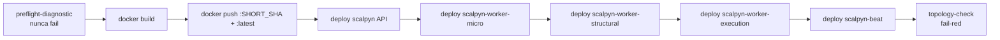

# 41 — Deploy + Cloud Build

Voltar ao [[00-INDEX]].

## `cloudbuild.yaml`

Trigger principal: **`806f4336`** (push em branch `main`). Histórico,
armadilhas e lições em `backend/docs/runbooks/cloudbuild-trigger-history.md`.

### Steps

1. **`preflight-diagnostic`** — loga identidade, projeto, região, quota,
   IAM. Wrapped em `|| true` (nunca falha). Sem isso, debug de falha
   silenciosa de IAM/quota requereria re-rodar build.
2. Build + push da imagem.
3. **5 deploys `gcloud run deploy`** — um por serviço Cloud Run
   ([[40-infra-cloudrun]]).
4. **`topology-check`** — verifica que os 5 serviços existem após o
   deploy. **Não remover** este step.

### Substitutions

- `${PROJECT_ID}`, `${SHORT_SHA}` — automáticas.
- `${_REGION}`, `${_REPO}`, `${_SERVICE}` — definidas no trigger.

### Lições do recovery 2026-05-08

(detalhes em `backend/docs/runbooks/cloudbuild-trigger-history.md`)

1. **SA do trigger** é `330575088921-compute@`, **não**
   `scalpyn-service-account@`. IAM bindings têm que cobrir os dois.
2. **Shell vars em scripts inline** precisam de `$$VAR`, não `$VAR`
   (Cloud Build interpola `$VAR` como substitution e some).
3. **`--update-secrets` é incremental**. Use `--remove-secrets` para
   desligar. Forçar a lista completa a cada deploy se quiser estado
   declarativo.
4. **`gcloud run services describe` NÃO aceita `--filter`**. Use
   `--format=json | python3 ...`.
5. **Origin do Replit é gitsafe-backup**, não GitHub direto. Para
   trigger funcionar, push tem que chegar no GitHub via gitsafe-backup.

### Flag inválida que **não existe**

`--timeout-startup=540` em `gcloud run deploy`. Não existe (Task #244).
Em 2026-05-07 esse flag derrubou silenciosamente 6 builds verdes
consecutivos com só `scalpyn` em prod.

Para budget de startup probe use o flag correto **`--timeout`** (300) e
o probe definido no spec (`startup_probe.timeout_seconds`).

## Configurações por serviço (no `cloudbuild.yaml`)

Todos os 5 serviços compartilham:
- `--ingress all`
- `--port 8080`
- `--timeout 300`
- `--min-instances 1`
- `--no-cpu-throttling`, `--cpu-boost`
- `--memory 2Gi`
- `--add-cloudsql-instances clickrate-477217:us-central1:scalpyn`
- Secret Manager: `DATABASE_URL`, `JWT_SECRET`, `ENCRYPTION_KEY`,
  `AI_KEYS_ENCRYPTION_KEY`, `PROMETHEUS_BEARER_TOKEN`.

## Vercel (frontend)

Deploy automático no push da branch `main` (separado do Cloud Build).
Env `BACKEND_URL` aponta para a URL `*.run.app` do `scalpyn`.

## `replit.md` user preference

> **Sempre publicar (deploy) ao final de cada tarefa.** Após
> `mark_task_complete`, chamar `suggest_deploy`.

## Áreas relacionadas

[[40-infra-cloudrun]] · [[20-celery-topology]] · [[42-observability]]
