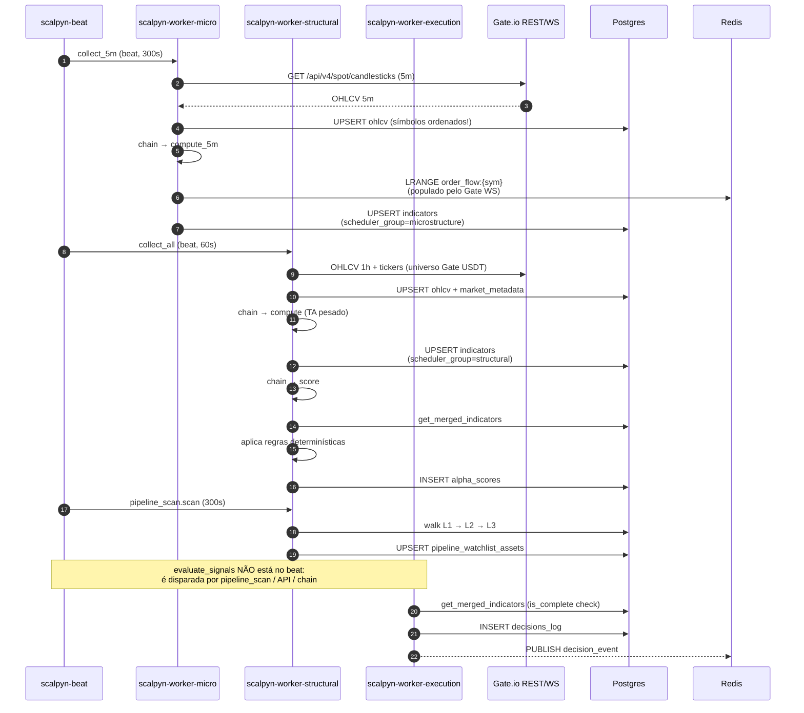
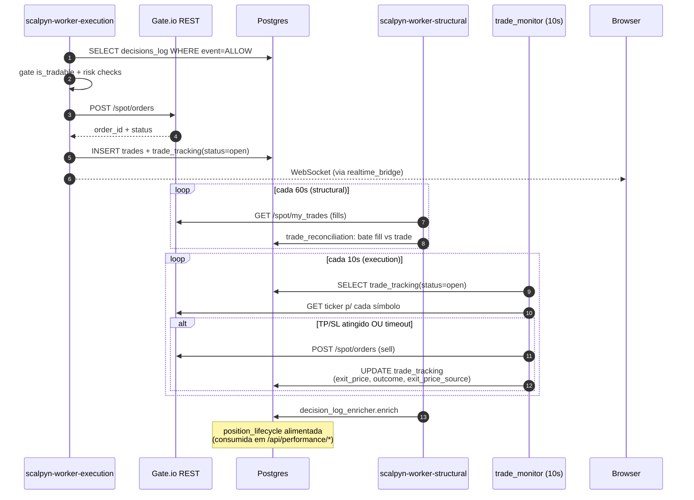
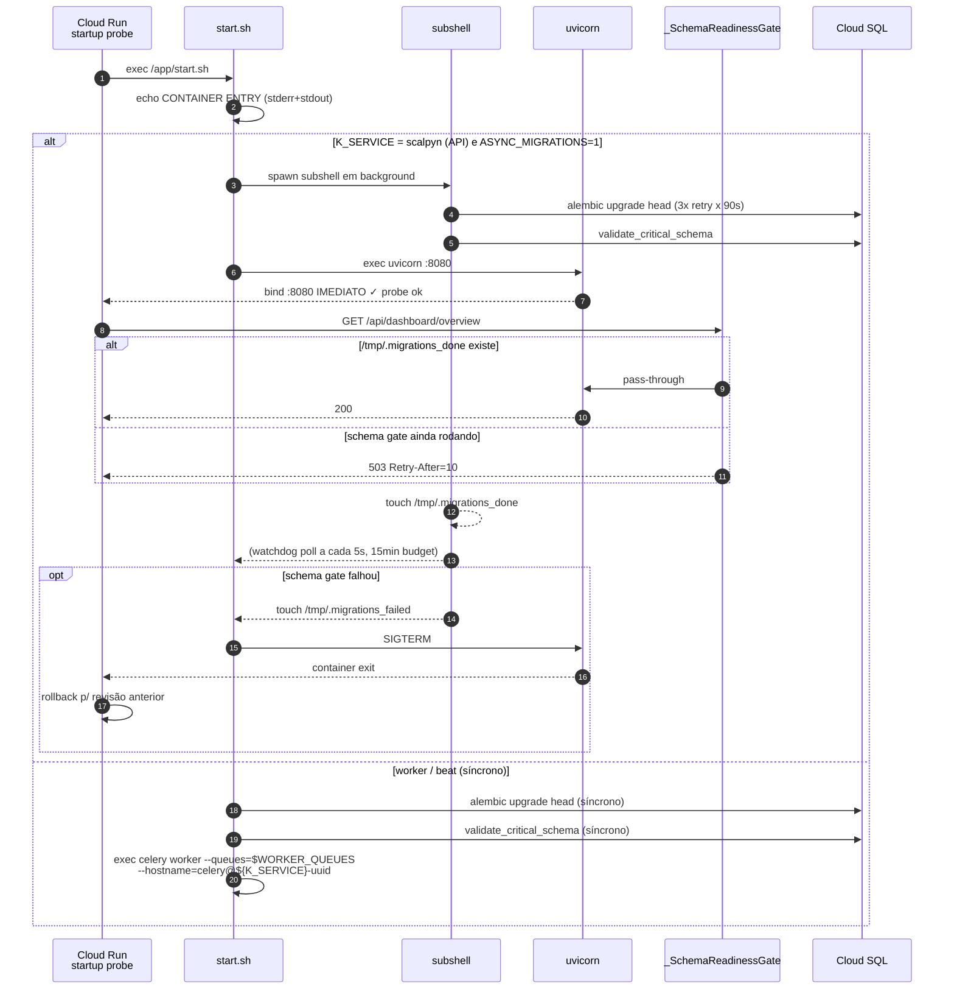

# 50 — Fluxos Cross-Área

Diagramas sequenciais dos 3 fluxos mais críticos do Scalpyn. Cada passo
faz wiki-link para a área que o implementa.

Voltar ao [[00-INDEX]].

## (a) Ingestão → Indicadores → Score → Decisão

Áreas envolvidas: [[15-exchange-integration]] · [[21-tasks-catalog]] ·
[[11-services]] (indicators_provider) · [[13-scoring-ml]] ·
[[12-engines]]

## (b) Decisão → Execução → Reconciliação

Áreas envolvidas: [[12-engines]] · [[15-exchange-integration]] ·
[[21-tasks-catalog]] · [[14-models-database]] · [[13-scoring-ml]]
(dataset ML)

## (c) Cloud Run boot (gate de schema)

Áreas envolvidas: [[40-infra-cloudrun]] · [[10-backend-api]] ·
[[14-models-database]] · [[20-celery-topology]]

## Áreas relacionadas

[[00-INDEX]] · [[10-backend-api]] · [[11-services]] · [[12-engines]] ·
[[13-scoring-ml]] · [[14-models-database]] · [[15-exchange-integration]] ·
[[20-celery-topology]] · [[21-tasks-catalog]] · [[40-infra-cloudrun]] ·
[[41-deploy-cloudbuild]] · [[42-observability]]
