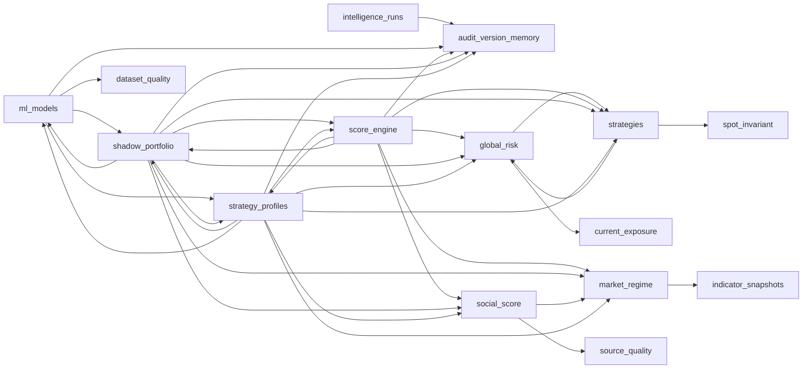

# Scalpyn Multi-Module Dependency Map

Source: `backend/app/ai_orchestration/module_registry.py`.

All registry modules are tenant-scoped. External guard concepts are leaves, not AI mutation targets.
