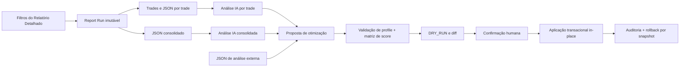

# Shadow Portfolio — Relatório Detalhado e Otimização de Profiles

## Status desta especificação

- Planejamento e validação de contratos.
- Nenhuma alteração funcional, migração ou implantação faz parte desta etapa.
- A implementação deve ocorrer em worktree limpa porque o checkout atual contém alterações não relacionadas.

## Objetivo

Adicionar ao `Shadow Portfolio` uma aba **Relatório Detalhado** para selecionar uma amostra de Shadow Trades, inspecionar e exportar cada trade ou a seleção consolidada, solicitar análises por IA e transformar recomendações de IA ou análises externas em propostas seguras de otimização dos profiles existentes.

O recurso deve otimizar o mesmo profile sem:

- criar outro profile;
- renomear o profile;
- trocar o `profile.id`;
- alterar o `profile_version`;
- promover, ativar ou mudar a associação live automaticamente.

## Decisões de produto

1. A análise de IA é sempre somente leitura.
2. Uma recomendação nunca é aplicada diretamente pela resposta textual da IA.
3. Toda recomendação deve virar um documento estruturado, validado e apresentado como `DRY_RUN` com diff.
4. O botão **Aplicar correções** executa uma atualização in-place somente depois de revisão e confirmação humana explícita.
5. A aplicação é feita por profile, mesmo quando a análise consolidada produzir recomendações para vários profiles.
6. Alterações da matriz global de score e do profile são validadas e gravadas na mesma transação.
7. `profile_config_hash` e o evento de auditoria passam a identificar o antes/depois da otimização, preservando `profile_version` conforme solicitado.
8. Uma regra global compartilhada não pode ser alterada silenciosamente: o diff deve listar todos os profiles afetados. Para uma mudança exclusiva, deve ser criada/reutilizada uma regra global de ID canônico e associada apenas ao profile-alvo.

## Auditoria dos contratos atuais

| Área | Contrato existente | Pode ser reutilizado | Lacuna que a implementação deve fechar |
|---|---|---|---|
| Shadow Trades | `GET /api/shadow-trades` filtra status, símbolo, datas, origem e um profile | Listagem básica e autenticação | Outcome é filtrado no cliente; seleção por profile remove o filtro de origem; paginação local é limitada; não há seleção múltipla de profiles/watchlists |
| Origem da amostra | `ShadowTrade.source` aceita `L3`, `L3_REJECTED` e `L1_SPECTRUM`, entre outras origens internas | Os três grupos pedidos já possuem representação canônica | A UI deve separar origem da amostra de watchlist real e não descartar uma delas quando o profile for escolhido |
| Watchlist | `shadow_trades` possui `watchlist_id`, `watchlist_name`, `watchlist_level` e linhagem | Filtragem e identificação histórica | Os campos não fazem parte do contrato enxuto/detalhado atual e linhas legadas podem ter valor nulo |
| Profile | `shadow_trades.profile_id`, nome, versão e hashes/snapshots preservam atribuição | Ligação do trade ao profile | O relatório deve usar a atribuição capturada no trade, não o estado atual inferido pelo nome |
| Detalhe/exportação | A tela por trade já monta `scalpyn.shadow_trade_export` com indicadores, auditoria e gráfico | Mesmo schema canônico por trade | A montagem é client-side; não existe exportação consolidada de uma seleção imutável; alguns campos de linhagem/captura não são expostos |
| Profile JSON | `profiles.config` contém `filters`, `scoring`, `signals`, `block_rules`, `entry_triggers` e timeframe | Estrutura funcional do editor/importador | O bulk import pode criar profiles e os caminhos de update atuais mudam `profile_version`; ambos são inadequados para este fluxo |
| Score global | `config_profiles` do tipo `score` guarda `scoring_rules`; o profile usa `scoring.selected_rule_ids` | Matriz global, catálogos e regras existentes | IDs inexistentes podem cair silenciosamente em regras por legado/fallback; o write path não prova `selected_rule_ids subset scoring_rules.id` |
| IA | Settings armazena chaves criptografadas de Anthropic, OpenAI e Gemini | Credenciais, validação e limites mensais | O Co-Pilot aceita apenas Anthropic/OpenAI; não há contrato de catálogo de modelos para a nova tela; Gemini não possui adapter de análise no Co-Pilot |
| Aprovação | `CopilotActionPlan` já oferece DRY_RUN, state hash, diff, confirmação, stale check e auditoria | Envelope de proposta/aprovação | O executor atual cria um novo candidato Shadow; não deve ser reutilizado para executar a otimização in-place |

### Evidência do JSON fornecido

O arquivo `docs/scalpyn_30_l3_profiles_ab_test.json` contém `[arquivo] 30` profiles. Todos trazem somente `scoring.weights` e `scoring.thresholds`; `[arquivo] 0` deles traz `scoring.selected_rule_ids`. A raiz contém apenas `profiles`, sem `scoring_rules`, `global_scoring` ou `scoring_assignments`.

Consequência: esse arquivo é uma boa fonte de configuração de profiles, mas não satisfaz sozinho o vínculo obrigatório com **Score Engine Configuration**. Ele não pode ser aceito como uma proposta aplicável até que cada profile receba associações explícitas a IDs existentes ou a regras globais incluídas no mesmo patch.

## Modelo mental da solução



## Relatório Detalhado

### Filtros

A aba deve oferecer:

- **Origem da amostra**:
  - `L3` — Aprovados (L3);
  - `L3_REJECTED` — Rejeitados (L3);
  - `L1_SPECTRUM` — Dataset ML (L1).
- **Watchlists** disponíveis dentro da origem selecionada:
  - todas;
  - uma ou várias selecionadas;
  - opção explícita `Sem vínculo/legado` quando houver trades sem linhagem.
- **Profiles** disponíveis na combinação origem + watchlist:
  - todos;
  - um ou vários selecionados.
- **Período**:
  - data inicial e final;
  - atalhos `[solicitação] 1, 7, 15, 30 e 90 dias`;
  - timezone visível da conta;
  - para TP/SL, a data canônica do filtro é `COALESCE(exit_timestamp, completed_at)`.
- **Resultado**:
  - Todos;
  - TP (`TP_HIT`);
  - SL (`SL_HIT`).

O backend deve receber arrays de `source`, `watchlist_id`, `profile_id` e `outcome`. A opção “todos” significa ausência do filtro correspondente, nunca uma lista montada no browser.

Datas escolhidas no timezone da conta devem ser convertidas para UTC. O início é inclusivo e o fim é exclusivo no instante seguinte ao fim do dia, evitando perda ou duplicação nos limites.

### Execução do relatório

O botão **Executar** cria um `ReportRun` imutável contendo:

- usuário;
- filtros normalizados;
- timezone;
- hash da consulta;
- IDs dos trades selecionados, em ordem estável;
- hash do conjunto de IDs;
- contagem retornada pelo banco;
- data de criação;
- status e diagnóstico de completude.

Novos trades que chegarem depois não podem mudar um relatório já executado. Para atualizar a amostra, o usuário executa novamente e cria outro `ReportRun`.

### Resultado visual

Cada linha deve mostrar, no mínimo:

- fechamento;
- símbolo;
- origem;
- watchlist;
- profile;
- config hash/profile version capturados;
- TP ou SL;
- entrada, saída, P&L, MAE, MFE e holding quando disponíveis;
- badges de completude/linhagem;
- **Abrir detalhe**;
- **Baixar JSON**;
- **Analisar com IA**.

A barra da seleção deve oferecer:

- **Baixar JSON consolidado**;
- **Analisar todos com IA**;
- contagem da amostra e filtros efetivamente aplicados.

O resultado deve usar paginação/cursor server-side. Nenhum filtro de outcome, profile, watchlist ou origem pode depender de baixar uma quantidade limitada de linhas e filtrar no cliente.

## Contratos de exportação

### Exportação por trade

Evoluir o builder atual para um serviço backend canônico, mantendo compatibilidade com o schema existente:

```json
{
  "export_metadata": {
    "schema": "scalpyn.shadow_trade_export",
    "schema_version": "2.0.0",
    "generated_at": "ISO-8601",
    "completeness": {}
  },
  "selection_context": {
    "report_run_id": "uuid-or-null",
    "source": "L3",
    "watchlist_id": "uuid-or-null",
    "profile_id": "uuid-or-null"
  },
  "trade": {},
  "decision_audit": {},
  "lineage": {},
  "snapshots": {},
  "indicator_analysis": {},
  "chart": {},
  "raw": {}
}
```

Regras:

- não reconstruir o passado usando a configuração atual do profile;
- preservar `config_snapshot`, `rules_snapshot`, indicadores de entrada/saída e hashes capturados;
- expor `null` e motivo de ausência, sem inventar valor;
- marcar capture gaps em `completeness`;
- manter os marcadores B/S e a janela de gráfico já implementada;
- não expor segredos, chaves de IA ou dados de outro usuário.

### Exportação consolidada

```json
{
  "export_metadata": {
    "schema": "scalpyn.shadow_trade_report_export",
    "schema_version": "1.0.0",
    "generated_at": "ISO-8601",
    "report_run_id": "uuid",
    "filters_hash": "sha256",
    "trade_ids_hash": "sha256"
  },
  "selection": {},
  "summary": {},
  "completeness": {},
  "trades": []
}
```

Cada item de `trades` usa o mesmo documento canônico da exportação individual. A geração deve ser incremental/assíncrona para não carregar toda a janela no browser. O arquivo final continua sendo `.json`, com checksum e download autenticado.

## Análise por IA

### Seleção de provider e modelo

A nova tela deve reutilizar somente chaves ativas e validadas em **Settings → General → Integrações de IA**.

Adicionar um contrato de leitura como:

- `GET /api/ai-keys/capabilities` — providers configurados/validados;
- `GET /api/ai-keys/{provider}/models` — modelos utilizáveis para análise estruturada.

O catálogo deve ser obtido do provider, filtrado por capacidade e cacheado. A resposta nunca contém a chave. Provider e modelo escolhidos são gravados no job de análise.

O adapter de análise deve ter uma interface única para Anthropic, OpenAI e Gemini. O caminho atual do Co-Pilot continua intacto até seus testes de regressão passarem.

### Jobs

Criar jobs persistentes para:

- `TRADE_ANALYSIS` — um `shadow_trade_id` e, opcionalmente, `report_run_id`;
- `REPORT_ANALYSIS` — um `report_run_id` imutável.

Cada job registra:

- usuário;
- escopo e IDs de entrada;
- provider/model;
- versão do prompt e do schema de saída;
- input hash;
- status, tentativas e idempotency key;
- uso reportado pelo provider;
- resposta estruturada;
- texto bruto sanitizado;
- erro, quando houver;
- timestamps.

A análise consolidada deve usar processamento em lotes e síntese final quando a amostra não couber no contexto do modelo. Limites de lote, custo e paralelismo devem vir de configuração no banco e ser editáveis, respeitando o princípio **ZERO HARDCODE**.

### Saída estruturada obrigatória

A IA deve retornar JSON validado, separando:

- fatos observados;
- métricas com unidade, N e proveniência;
- hipóteses/inferências;
- problemas de qualidade dos dados;
- recomendações por profile;
- evidências por `trade_id`;
- confiança e limitações;
- patch proposto, quando aplicável.

Uma resposta textual inválida pode ser exibida, mas não habilita **Aplicar correções**.

## Otimizações de Profile

### Fontes permitidas

Uma proposta pode nascer de:

- análise de IA por trade;
- análise de IA consolidada;
- upload de JSON produzido por análise externa.

Todas as fontes convergem para o mesmo schema e para o mesmo validador. Não existe caminho privilegiado para a IA interna.

### Schema canônico de otimização

```json
{
  "schema": "scalpyn.profile_optimization_patch",
  "schema_version": "1.0.0",
  "target": {
    "profile_id": "uuid",
    "profile_name": "immutable-name",
    "expected_profile_config_hash": "sha256",
    "expected_profile_version": "ISO-8601-or-null"
  },
  "evidence": {
    "report_run_id": "uuid-or-null",
    "analysis_job_id": "uuid-or-null",
    "trade_ids_hash": "sha256",
    "trade_ids": [],
    "sample": {}
  },
  "changes": [
    {
      "op": "add|replace|remove",
      "path": "/signals/conditions/0/value",
      "old_value": null,
      "value": null,
      "reason": "...",
      "evidence_refs": []
    }
  ],
  "score_matrix_patch": {
    "expected_config_hash": "sha256",
    "upsert_rules": [],
    "remove_rule_ids": []
  },
  "score_assignment": {
    "selected_rule_ids": []
  },
  "constraints": {
    "preserve_profile_id": true,
    "preserve_profile_name": true,
    "preserve_profile_version": true,
    "create_profile": false
  }
}
```

Paths permitidos devem cobrir:

- `/default_timeframe`;
- `/filters`;
- `/scoring/weights`;
- `/scoring/thresholds`;
- `/scoring/selected_rule_ids`;
- `/signals`;
- `/block_rules`;
- `/entry_triggers`.

Nome, `id`, `profile_version`, tipo, role, pipeline e flags live/shadow ficam fora da allowlist. A descrição pode ser tratada como metadado separado, se desejado, sem afetar identidade.

### Invariante de Score Engine Configuration

O backend deve aplicar as seguintes regras antes de habilitar o botão de confirmação:

1. `scoring.selected_rule_ids` é obrigatório quando scoring está habilitado ou quando `signals`/`entry_triggers` usam o campo `score`.
2. Cada ID selecionado deve existir exatamente uma vez em `global_score.scoring_rules`.
3. Todo `rule_id` explícito em filters, signals ou entry triggers deve existir na matriz e estar presente em `selected_rule_ids`.
4. Uma nova regra recomendada deve aparecer em `score_matrix_patch.upsert_rules` e em `score_assignment.selected_rule_ids` na mesma proposta.
5. IDs duplicados, ausentes, incompatíveis com o catálogo ou com operador inválido bloqueiam o DRY_RUN.
6. A hidratação após o patch deve resolver exatamente o conjunto selecionado. Não pode cair para todas as regras globais.
7. Remover uma regra global é proibido enquanto qualquer profile a referencia.
8. Alterar uma regra compartilhada exige mostrar todos os profiles afetados e confirmação específica; caso contrário, o sistema deve criar/reutilizar uma regra canônica exclusiva.
9. Uma condição `score >= X` é um gate sobre o resultado do Score Engine; ela só é válida se o profile tiver associação explícita e íntegra com as regras que produzem o score.
10. Block Rules permanecem vetos do profile. Seus indicadores e operadores são validados, mas só exigem associação à matriz quando também forem usados como regra de score ou trouxerem `rule_id` explícito.

O resolver de runtime deve falhar fechado quando `selected_rule_ids` está presente mas não resolve integralmente. O fallback legado só pode continuar para profiles antigos sem associação explícita, e deve emitir auditoria/telemetria para saneamento.

### DRY_RUN, confirmação e aplicação

Reutilizar o envelope de `CopilotActionPlan` com um novo `action_type`, por exemplo `OPTIMIZE_PROFILE_IN_PLACE`. Não alterar a semântica do executor atual de candidatos.

Fluxo:

1. Carregar e bloquear logicamente o profile e a matriz de score pelo hash atual.
2. Normalizar o patch e validar o schema.
3. Construir os documentos candidatos em memória.
4. Executar os validadores de profile, catálogo e vínculo de score.
5. Calcular diff de profile, score e impacto em outros profiles.
6. Mostrar evidências, riscos, campos sem dados e plano de rollback.
7. Exigir confirmação digitada e usuário autenticado.
8. No `execute`, obter row locks, recalcular hashes e marcar `STALE` se qualquer alvo mudou.
9. Gravar matriz de score, profile e auditoria na mesma transação.
10. Garantir por assertions pós-write que `id`, nome e `profile_version` continuam iguais.

Rollback restaura o snapshot anterior em outra operação explícita e auditada; também preserva identidade e `profile_version`.

## APIs propostas

### Facetas e relatório

- `GET /api/shadow-trades/detailed-report/facets`
  - retorna origens, watchlists, profiles e contagens válidas para os filtros antecedentes.
- `POST /api/shadow-trades/detailed-report/runs`
  - normaliza filtros, materializa a seleção e retorna `report_run_id`.
- `GET /api/shadow-trades/detailed-report/runs/{run_id}`
  - metadados, filtros efetivos, status e completude.
- `GET /api/shadow-trades/detailed-report/runs/{run_id}/trades`
  - paginação/cursor server-side.
- `GET /api/shadow-trades/{trade_id}/export`
  - JSON canônico por trade.
- `POST /api/shadow-trades/detailed-report/runs/{run_id}/export`
  - inicia artefato consolidado.
- `GET /api/shadow-trades/detailed-report/exports/{export_id}`
  - status e URL autenticada/stream de download.

### IA

- `POST /api/shadow-trade-analysis/jobs`
  - cria análise por trade ou report run.
- `GET /api/shadow-trade-analysis/jobs/{job_id}`
  - status, saída estruturada e erros.
- `POST /api/shadow-trade-analysis/jobs/{job_id}/retry`
  - retry idempotente quando permitido.

### Otimização

- `POST /api/profile-optimizations/import`
  - valida JSON externo e cria DRY_RUN.
- `POST /api/profile-optimizations/from-analysis/{job_id}`
  - converte recomendações estruturadas em DRY_RUN.
- `GET /api/profile-optimizations/{plan_id}`
  - diff, impacto, vínculos de score e evidência.
- `POST /api/profile-optimizations/{plan_id}/approve`
  - confirmação humana.
- `POST /api/profile-optimizations/{plan_id}/execute`
  - aplicação transacional in-place.
- `POST /api/profile-optimizations/{plan_id}/rollback`
  - restauração explícita do snapshot.

## Persistência

Adicionar entidades persistentes equivalentes a:

- `shadow_trade_report_runs`;
- `shadow_trade_report_items`;
- `shadow_trade_export_jobs`;
- `shadow_trade_analysis_jobs`.

Reutilizar, quando suficiente:

- `copilot_action_plans` para DRY_RUN/aprovação/estado stale;
- `copilot_audit_logs` para eventos do fluxo;
- `profile_audit_log` para snapshots antes/depois do profile.

O `profile_audit_log` deve registrar `previous_profile_version == new_profile_version` neste fluxo. O hash do config e o `action_plan_id` identificam a revisão de otimização sem criar outra versão de profile.

Toda migração deve ser aditiva, reversível e revisada com os guardrails de Alembic do projeto.

## Frontend

Adicionar `mainTab = "detailed-report"` ao Shadow Portfolio e extrair a implementação para componentes dedicados, evitando ampliar ainda mais o arquivo monolítico atual:

- `DetailedReportFilters`;
- `DetailedReportResults`;
- `DetailedReportActions`;
- `TradeAnalysisPanel`;
- `ProfileOptimizationWorkspace`;
- `OptimizationDiffReview`;
- `ExternalOptimizationImport`.

Estados de UI obrigatórios:

- carregando facetas;
- filtros inválidos;
- executando relatório;
- vazio;
- paginação;
- exportação em fila/processando/pronta/falha;
- análise em fila/processando/pronta/falha/cancelada;
- resposta não estruturada;
- proposta válida/inválida/stale;
- impacto em regra compartilhada;
- confirmação/aplicação/rollback.

O botão **Aplicar correções** deve permanecer desabilitado até o DRY_RUN completo passar por todos os validadores.

## Plano de implementação

### Fase 1 — Congelar contratos e corrigir invariantes

- Definir schemas Pydantic/TypeScript compartilhados para filtros, exportações, análise e optimization patch.
- Criar o validador forte de associação profile ↔ matriz global.
- Alterar o resolver para falhar fechado quando IDs explícitos não resolvem.
- Criar auditor de compatibilidade read-only para listar profiles atuais com vínculos inválidos antes de qualquer rollout.
- Cobrir `filters`, `scoring`, `signals`, `block_rules` e `entry_triggers` nos testes de validação.

### Fase 2 — Report Run e facetas

- Implementar migrações aditivas de report runs/items.
- Implementar facetas dependentes de origem/watchlist/profile.
- Implementar filtro server-side por outcomes, múltiplos profiles/watchlists e data de fechamento.
- Materializar seleção imutável com hashes e cursor estável.
- Adicionar a aba e os atalhos de data.

### Fase 3 — Exportações

- Mover a montagem do JSON canônico para o backend.
- Preservar compatibilidade do download já disponível na tela individual.
- Incluir linhagem, hashes, completude e campos de captura nativa.
- Implementar export job consolidado, streaming e checksum.

### Fase 4 — IA por trade e consolidada

- Expor providers validados e catálogo de modelos.
- Criar adapter comum Anthropic/OpenAI/Gemini.
- Implementar jobs, idempotência, limites configuráveis, retries e auditoria.
- Validar saída estruturada e exibir evidências/limitações.
- Implementar análise em lotes + síntese consolidada para amostras grandes.

### Fase 5 — Workspace de otimização

- Implementar importação do optimization patch externo.
- Converter saídas válidas da IA para o mesmo contrato.
- Reutilizar diff/state hash/approval do Co-Pilot com novo action type.
- Exibir diff de todas as seções, inclusive Block Rules e Entry Triggers.
- Exibir impacto das mudanças globais de score.

### Fase 6 — Aplicação in-place e rollback

- Criar executor transacional dedicado.
- Preservar `profile.id`, nome e `profile_version` por contrato e assertion.
- Atualizar score matrix + profile de modo atômico.
- Gravar snapshots e auditoria imutável.
- Implementar rollback explícito com stale check.
- Garantir que não exista criação de profile/watchlist, promoção ou alteração live nesse fluxo.

### Fase 7 — Verificação e rollout

- Implementar em worktree limpa e feature flag por usuário/ambiente.
- Rodar testes backend, frontend, contratos e migrações.
- Validar em staging com autenticação real, download parseável e provider configurado.
- Publicar backend/worker antes do frontend.
- Validar produção por rota afetada, logs, jobs, arquivo baixado, conteúdo do JSON e comportamento autenticado.
- Manter o botão de aplicação desligado por feature flag até o auditor de score não encontrar vínculos inválidos no escopo habilitado.

## Testes obrigatórios

### Backend e contratos

- filtro TP/SL no banco, sem cap/filtro local;
- combinação simultânea de origem, watchlist e vários profiles;
- limites de data e timezone;
- linhas legadas sem watchlist/profile;
- report run imutável quando chegam novos trades;
- isolamento por `user_id` em run, export, analysis e optimization plan;
- igualdade entre o documento por trade e o item consolidado;
- exportação grande sem carregar tudo em memória;
- provider/model não configurado ou não validado;
- Gemini, Anthropic e OpenAI pelo mesmo schema de saída;
- retry idempotente e respeito ao limite configurado;
- saída textual inválida não habilita apply;
- patch externo malformado ou com path fora da allowlist;
- adição, alteração e remoção em todas as seções permitidas;
- Block Rules com lógica/condições completas;
- `selected_rule_ids` inexistente, duplicado ou parcial bloqueado;
- condição `score` sem matriz associada bloqueada;
- nova regra global sem assignment bloqueada;
- remoção de regra ainda referenciada bloqueada;
- regra compartilhada mostra impacto;
- stale hash de profile ou matriz bloqueia execução;
- falha no segundo write reverte a transação inteira;
- aplicação e rollback preservam ID, nome e `profile_version`;
- nenhuma chamada desse fluxo cria Profile ou Watchlist.

### Frontend/E2E

- atalhos de período e datas manuais;
- seleção todos/selecionados de watchlists e profiles;
- Todos/TP/SL;
- execução, paginação e restauração dos filtros do report run;
- download individual e consolidado parseáveis;
- ações de IA por linha e pela seleção;
- seleção provider/model conforme Settings;
- exibição de loading, erro, retry e resultado estruturado;
- upload externo, diff, impacto de score e confirmação;
- bloqueio de Apply inválido/stale;
- evidência visual de que ID, nome e versão não mudaram após aplicar.

## Critérios de aceite

1. Um usuário autenticado consegue produzir uma relação exata de TP, SL ou ambos para os filtros escolhidos sem truncamento silencioso.
2. Cada linha baixa um JSON completo e a seleção baixa um JSON consolidado que contém exatamente os IDs materializados no report run.
3. Cada trade e a amostra inteira podem ser analisados usando uma integração e modelo válidos escolhidos na tela.
4. A resposta da IA exibe fatos, inferências, limitações e evidências; somente JSON válido pode originar proposta.
5. Um JSON externo válido percorre o mesmo DRY_RUN e os mesmos gates.
6. O diff aceita parâmetros de filters, scoring, signals, block rules e entry triggers.
7. Nenhuma proposta com score órfão ou associação parcial é aplicável.
8. A aplicação atualiza o profile existente e, quando necessário, a matriz global em uma única transação.
9. `profile.id`, nome e `profile_version` permanecem literalmente iguais antes/depois.
10. Toda aplicação/rollback possui snapshots, hash, usuário, fonte, evidências e resultado auditáveis.
11. O fluxo não cria, renomeia ou promove profiles.

## Fora de escopo

- criação de profiles;
- clonagem/candidatos/versionamento novo;
- renomeação;
- promoção Shadow → Live;
- ativação/desativação de trading;
- mutação automática sem confirmação humana;
- retreino de modelos ML;
- alteração retroativa de trades/snapshots históricos;
- criação automática de watchlists.

## Casos extremos

- trade legado sem profile ou watchlist: exportar e analisar com flag de linhagem incompleta, sem atribuição inventada;
- profile foi alterado após a análise: marcar proposta `STALE` e exigir novo DRY_RUN;
- matriz global mudou após o diff: marcar `STALE`;
- uma regra sugerida já existe semanticamente com outro ID: reutilizar após canonicalização e mostrar a decisão;
- um profile usa regra global compartilhada: mostrar grafo de impacto antes de qualquer alteração;
- provider indisponível ou quota esgotada: manter o job recuperável e não perder o report run;
- parte dos trades não possui snapshot de saída: consolidar somente valores presentes e reportar o N válido por métrica;
- JSON consolidado muito grande: gerar assíncrono e fazer stream; nunca truncar silenciosamente;
- análise externa aponta outro profile pelo nome: exigir `profile_id` e hash; nome isolado não autoriza alteração;
- profile usa `score` em signals/entry triggers mas não possui assignment íntegro: bloquear apply até saneamento explícito.

## Ledger de Evidências

| NÚMERO REPORTADO | ORIGEM | VALOR LITERAL DA FONTE |
|---|---|---|
| profiles no JSON = 30 | `[arquivo] docs/scalpyn_30_l3_profiles_ab_test.json` | `profiles=30` |
| profiles com `selected_rule_ids` = 0 | `[arquivo] docs/scalpyn_30_l3_profiles_ab_test.json` | `with_selected_rule_ids=0` |
| profiles sem `selected_rule_ids` = 30 | `[arquivo] docs/scalpyn_30_l3_profiles_ab_test.json` | `without_selected_rule_ids=30` |
| atalhos de data = 1, 7, 15, 30, 90 dias | `[solicitação do usuário]` | `últimos 1, 7, 15, 30d e 90d` |
